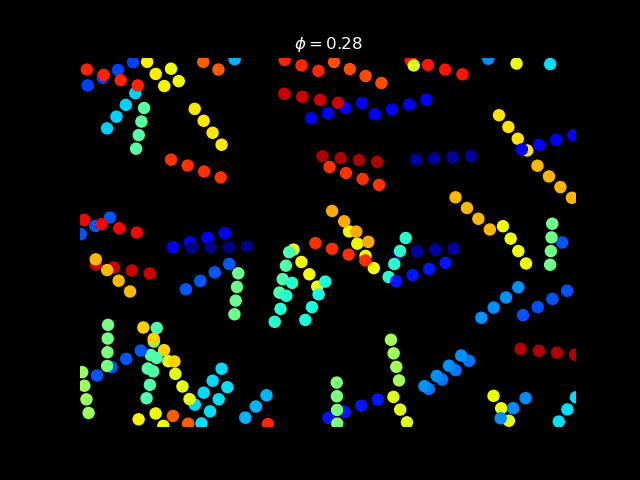
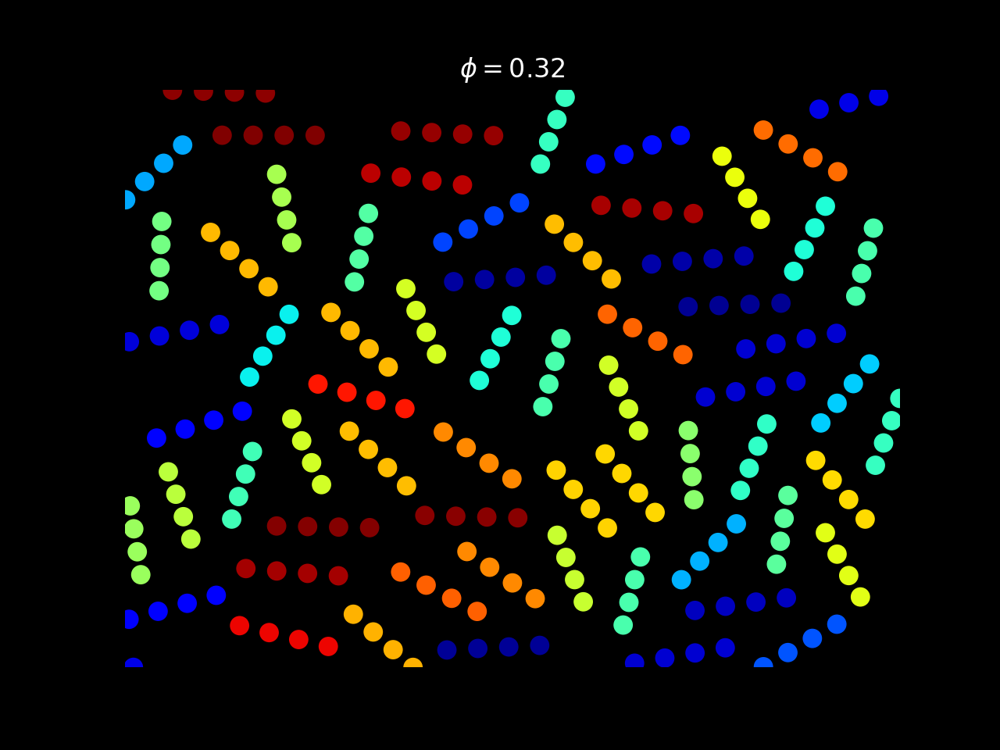
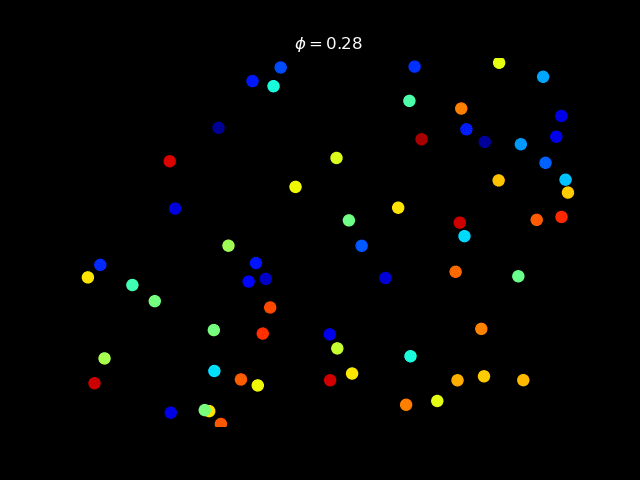

# Chrial Active Matter

Active spinner systems, a non-equilibrium system, exhibit unconventional
properties such as edge currents, frustration-induced melting (under pressure),
and periodicity in spatial ordering. [Von Zuiden et al][active-dimers] examined
the spatial characteristics in a system composed of representative diatomic
molecules, which have no active linear force and have an internal active torque.
The competition between the active rotation and short-range repulsive forces
leads to various distinct phases that are controlled by local packing fraction.
In this proposed work, we extend the work by considering a system of stiff rods.
We explore the effects of particle geometry on the emergent phase behaviour.

## Running the Code

### Requirements

- Python 3.8+
- numpy 1.20.2+
- numba 0.53.1+
- celluloid 0.2.0+
- matplotlib 3.4.2+
- argparse 3.2+
- numexpr 2.7.3+

### Run Python Script

The main file is called 'main.py'. Run the code by navigating to the _/src_
directory. Within the _/src_ directory, use

> Python main.py --help

to see all available command-line flags. As an example, let's study the
behaviour of a system of 64 rods at a packing fraction near 0.1. We shall
_animate_ the system, calculate the _spatial correlation_ function, and tell our
script to print lots of information to the terminal (std):

> python main.py --phi 0.1 --verbose --animate --spatialCorr --frames 10 --spf
> 100 --color_orientation

here we are capturing only 10 frames, with 100 time steps between each frame,
and coloring the rods by their nematic orientation. We can save the results (and
supress showing animation at the end of the run) by calling the _--save_ flag.

To change the save directory, use

> --dirname "path_to_your_directory"

### Simulation Parameters

Our model consists of modeling actively rotating rods as rigid chains of 4
beads, subject to both a volume-exclusion spring force and a short-range yukawa
force with screening length of a bead diameter and cut off of four bead
diameters. Equations are shown in the pdf slides in the $/presentation$ folder.

The relevant parameters of the model are (paramters we used indicated in brackets):

- temperature: T [0.002]
- roatational diffusion: D_R [0.05]
- translational diffusion: D_T [0.05]
- **packing fractio**n: phi [0.0-0.8]
- **number of particles**: [100]
- friction coefficient: gamma [1.0]
- bead diameter: sigma [1.0]
- intrinsic angular velocity: alpha [0.05]

In order to study the effects of packing fraction on phase behaviour, we have
currently only implemented the bold paramters listed above (packing fraction and
number of particles) as directly slectable parameteres via the command-line, the
remaining paramters need to be altered within the 'main.py' script.

In our test cases, we considered a system of 100 rods (4 x 100 beads) and found
that 500,000 time steps takes approximately 20 minutes on a single thread
(multi-threading to be added in future updates) using an 10th gen intel i7
mobile processor.

We found that the current implementation of the model is stable for packing
fractions in the range of 0.0 - 0.8, where the box size changes based on the
specified number of particles and packing fraction desired.

## Media Examples

If the simualtion goes well, we should see the following animation:

<!-- #### Plotting rods as four beads

 -->

#### Plotting only the center of mass (--CoM)

[active-dimers]:
  https://doi.org/10.1073/pnas.1609572113
  "Spatiotemporal order and emergent edge currents in active spinner materials"
